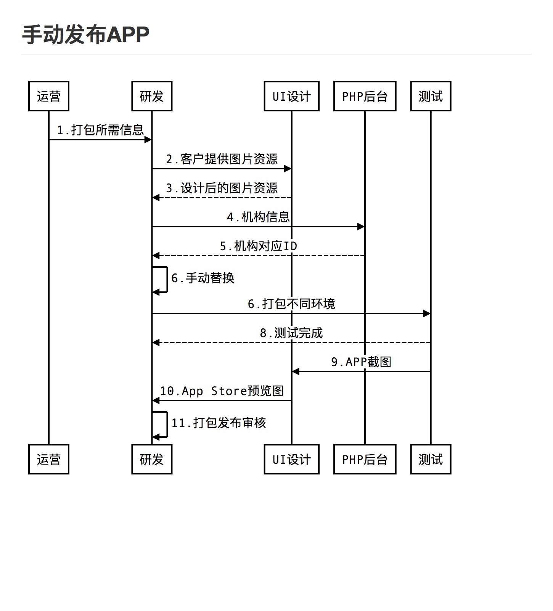
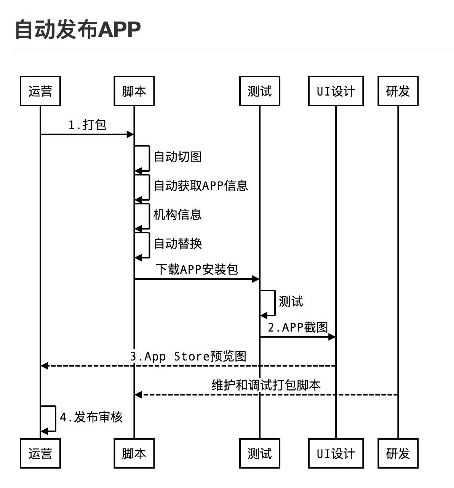

---?image=template/img/pencils.jpg

## @color[black](2018  工作回顾)

@fa[arrow-down text-black]

+++?image=template/img/bg/pink.jpg&position=right&size=50% 100%
@snap[north-west]
#### 工作回顾
@snapend

@snap[east span-30 text-28 text-left text-white]
@size[1.5em](10套模板)
@snapend

@snap[midpoint]
@img[split-screen-img span-55](template/img/developer.jpg)
@snapend

@snap[west span-35 text-28 text-right]
@size[1.5em](14个APP)
@snapend

+++?color=black

@snap[west span-20]
# 里程碑
@snapend

@snap[north-east span-80 fragment]
@box[bg-purple text-white](1.#APP家的上线，使家长APP更加灵活和多变，交换不同模板和UI.)
@snapend

@snap[east span-80 fragment]
@box[bg-orange text-white](2.#iOS自动打包，结束了研发频繁手动打包发布上线的繁重和重复工作.)
@snapend

@snap[south-east span-80 fragment]
@box[bg-pink text-white](3.#爱校星共享APP上线，让家长APP面向更广小众培训机构申请即可入驻.)
@snapend

+++?image=assets/img/debugger.gif&position=right&size=60% 90%
@snap[north-west]
#### 工作回顾
@snapend

@snap[west span-55]
自定义的工具
@ul[spaced]
* 切换不同机构
* 切换不同环境
* 切换不同模板
* 添加自定义机构ID
* 随时查看调试日志
* 添加自定义IP
@ulend
@snapend

+++
@snap[north-west]
#### 工作回顾
@snapend

@snap[west span-55]
@ul[spaced]
* 类：137个
* 封装类： 21个
* 代码：35487行
* 注释：8324行
* bug：36个
* 优化：49个
@ulend
@snapend

@snap[east span-45]
@img[shadow](assets/img/conference.png)
@snapend

+++?image=template/img/bg/pink.jpg&position=right&size=50% 100%
@snap[north-west]
#### 工作回顾
@snapend

@snap[east span-30 text-28 text-left text-white]
@size[1.5em](10套模板)
@snapend

@snap[midpoint]
@img[split-screen-img span-55](template/img/developer.jpg)
@snapend

@snap[west span-35 text-28 text-right]
@size[1.5em](14个APP)
@snapend

+++?image=template/img/bg/blue.jpg&position=bottom&size=100% 15%
@snap[north-west]
#### 工作回顾
@snapend

@snap[west span-50]

@snapend

@snap[east span-50]

@snapend

@snap[south text-white  span-100]
@size[1em](节省了90%时间)
@snapend

+++?image=template/img/bg/pink.jpg&position=right&size=50% 100%

@snap[east span-30 text-08 text-center text-white]
Excepteur sint occaecat cupidatat non proident, sunt in culpa qui officia deserunt mollit anim id est laborum.
@snapend

@snap[midpoint]
@img[split-screen-img span-55](template/img/developer.jpg)
@snapend

@snap[west span-35]
Lorem ipsum sit dolor amet, consectetur elit.
@snapend

@snap[south-west template-note text-gray]
Split-screen text and centered image template.
@snapend
