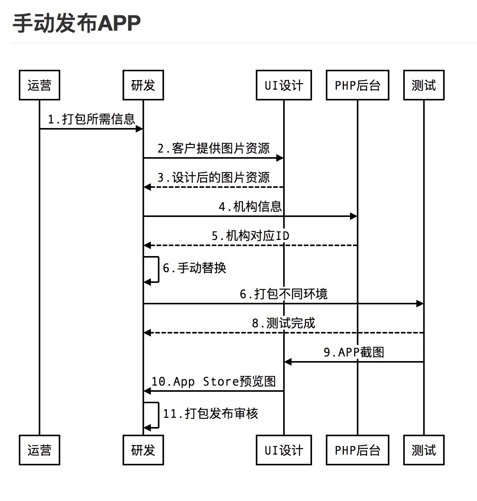

---?image=template/img/pencils.jpg

## @color[black](2018  工作回顾)

@fa[arrow-down text-black]

+++?image=template/img/bg/pink.jpg&position=right&size=50% 100%
@snap[north-west]
#### 工作回顾
@snapend

@snap[east span-30 text-28 text-left text-white]
@size[1.5em](10套模板)
@snapend

@snap[midpoint]
@img[split-screen-img span-55](template/img/developer.jpg)
@snapend

@snap[west span-35 text-28 text-right]
@size[1.5em](14个APP)
@snapend

+++?color=black

@snap[west span-20]
# 里程碑
@snapend

@snap[north-east span-80 fragment]
@box[bg-purple text-white](1.#APP家的上线，使家长APP更加灵活和多变，交换不同模板和UI.)
@snapend

@snap[east span-80 fragment]
@box[bg-orange text-white](2.#iOS自动打包，结束了研发频繁手动打包发布上线的繁重和重复工作.)
@snapend

@snap[south-east span-80 fragment]
@box[bg-pink text-white](3.#爱校星共享APP上线，让家长APP面向更广小众培训机构申请即可入驻.)
@snapend

+++?image=template/img/bg/blue.jpg&position=bottom&size=100% 15%
@snap[north-west]
#### 工作回顾
@snapend
    
@snap[west text-08 span-55]
封装类18个
@ul[spaced]
- 常用的UI类封装
- 用户管理类、机构管理类
- 常用的控制器的基类
- 通用的一些函数方法
- 数据存储管理类
- 项目配置文件管理
- 调试的日志管理类
- 常用宏的优化
- 部分功能的插件化封装
- 原生和H5交互的封装
@ulend
@snapend

@snap[east span-45]
@img[shadow](assets/img/conference.png)
@snapend

@snap[south text-white  span-100]
@size[1em](提升了20%开发时间)
@snapend

+++?image=template/img/bg/blue.jpg&position=bottom&size=100% 15%
@snap[north-west]
#### 工作回顾
@snapend

@snap[west span-50]

@snapend

@snap[east span-50]

@snapend

@snap[south text-white  span-100]
@size[1em](节省了90%时间)
@snapend

+++?image=assets/img/debugger.gif&position=right&size=contain
@snap[north-west]
#### 工作回顾
@snapend

@snap[west span-50]
调试工具
@ul[spaced]
* 切换不同机构
* 切换不同环境
* 切换不同模板
* 添加自定义机构ID
* 随时查看调试日志
* 添加自定义IP
@ulend
@snapend

@snap[south-west text-red  span-50]
@size[1em](提升测试和调试效率30%)
@snapend